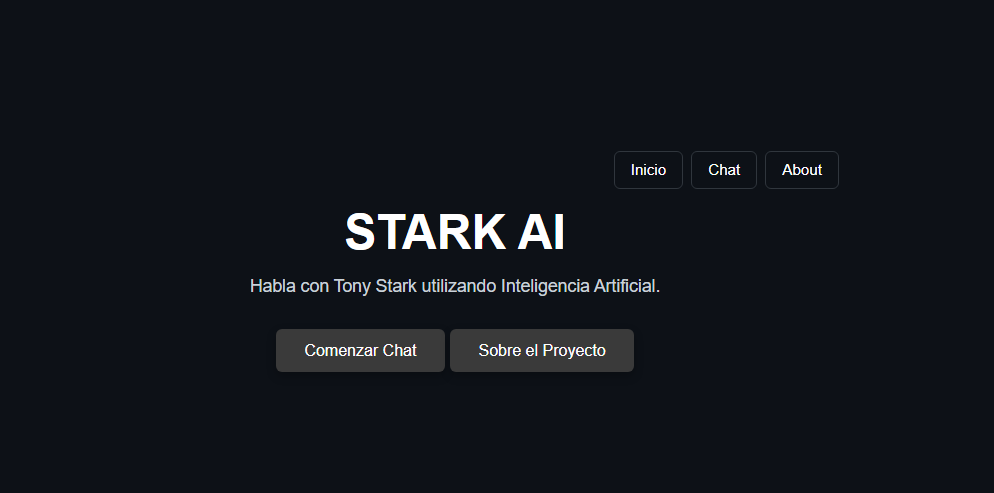
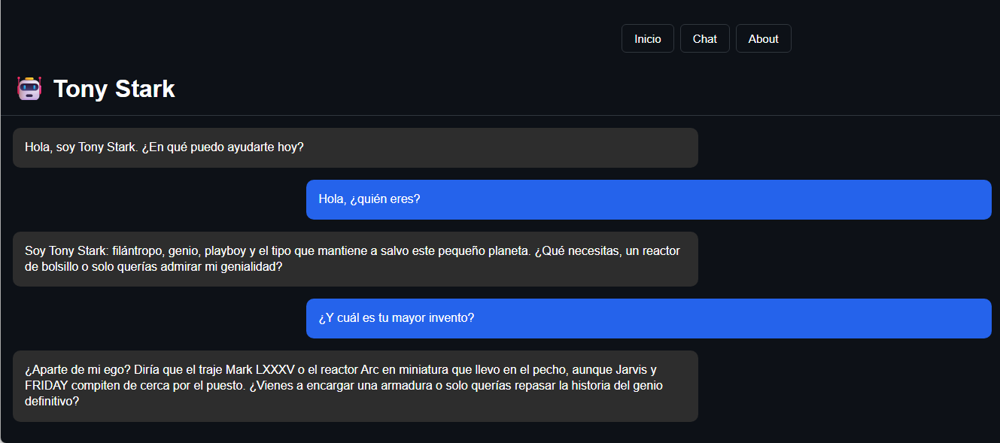
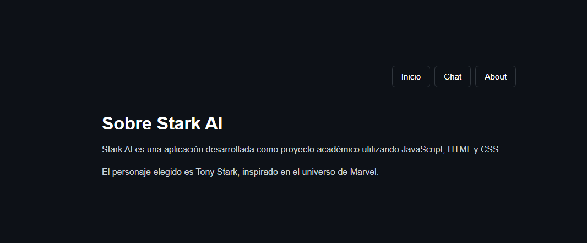
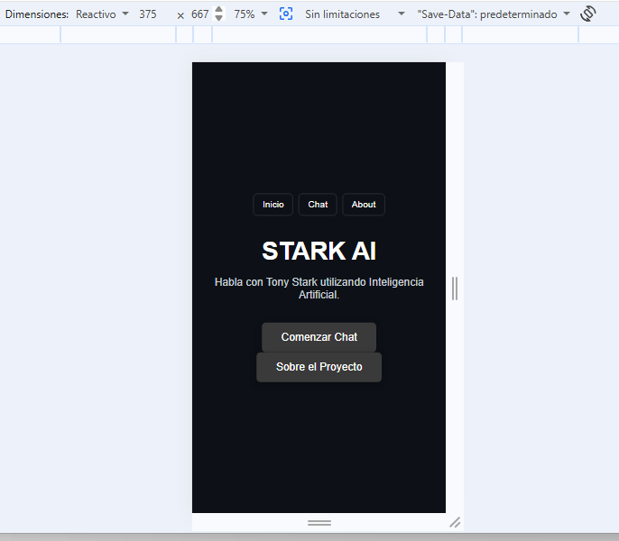
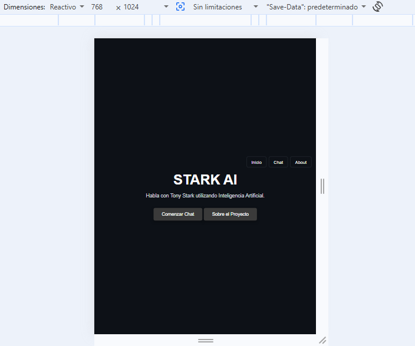
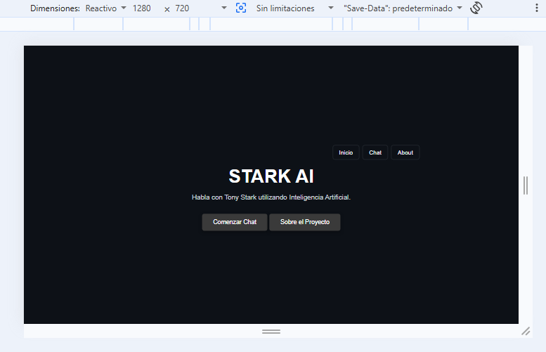

# Stark AI 

Aplicación web de chat con Inteligencia Artificial inspirada en el personaje ficticio Tony Stark.

El proyecto fue desarrollado como Proyecto Integrador utilizando JavaScript Vanilla y una arquitectura SPA (Single Page Application). La aplicación permite mantener una conversación con un asistente de IA que responde siguiendo una personalidad inspirada en Tony Stark.

La comunicación con Google Gemini se realiza de forma segura mediante una función Serverless de Vercel, evitando exponer la API Key en el frontend.

---

## Demo

Aplicación desplegada en Vercel:

**Stark AI:** https://stark-ai-chi.vercel.app/

---

## Repositorio

Código fuente del proyecto:

**GitHub:** https://github.com/marizapata/stark-ai

---

## Sobre el personaje

El personaje elegido para el proyecto es **Tony Stark**, inspirado en el universo de Marvel.

La personalidad implementada busca representar un personaje:

* Inteligente.
* Ingenioso.
* Seguro de sí mismo.
* Con humor sarcástico.
* Orientado a la tecnología.
* Con respuestas naturales y breves.

El comportamiento del personaje se define mediante un **system prompt** enviado desde la función Serverless.

El prompt establece la personalidad, el tono de comunicación y la extensión aproximada de las respuestas.

---

## Características

* Chat conversacional con Inteligencia Artificial.
* Personalidad personalizada de Tony Stark.
* Respuestas breves y naturales.
* Historial de conversación durante la sesión.
* Conservación del contexto de la conversación.
* Historial limitado para optimizar el consumo de tokens.
* Estado visual de "Pensando..." mientras se genera una respuesta.
* Manejo de errores de comunicación con la API.
* Manejo de errores por límite de solicitudes HTTP 429.
* API Key protegida mediante variables de entorno.
* Comunicación Frontend → Vercel Serverless Function → Gemini API.
* Single Page Application.
* Navegación entre Home, Chat y About.
* Navegación mediante History API.
* Soporte para botones Back y Forward del navegador.
* Scroll automático hacia el último mensaje.
* Diseño responsive Mobile-First.
* Adaptación para móvil, tablet y desktop.
* Tests unitarios implementados con Vitest.

---

## Tecnologías utilizadas

* HTML5
* CSS3
* JavaScript Vanilla
* Node.js
* Vercel
* Vercel Serverless Functions
* Google Gemini API
* `@google/genai`
* Vitest
* Git
* GitHub

---

## Arquitectura

La aplicación utiliza una arquitectura sencilla separando frontend y comunicación con la API de Inteligencia Artificial.

```text
Usuario
   │
   ▼
Frontend SPA
   │
   │ fetch()
   ▼
Vercel Serverless Function
/api/chat
   │
   │ API Key protegida
   ▼
Google Gemini API
   │
   ▼
Respuesta
   │
   ▼
Frontend
```

La API Key nunca se incluye en el código JavaScript del cliente.

---

## Estructura del proyecto

```text
stark-ai/
│
├── api/
│   └── chat.js
│
├── src/
│   ├── views/
│   │   ├── about.js
│   │   ├── chat.js
│   │   └── home.js
│   │
│   ├── app.js
│   ├── index.html
│   ├── styles.css
│   └── utils.js
│
├── tests/
│   └── utils.test.js
│
├── .env
├── .env.example
├── .gitignore
├── package.json
├── package-lock.json
├── README.md
└── vercel.json
```

---

# Routing SPA

La aplicación utiliza **History API** para realizar navegación sin recargar la página.

Las rutas principales son:

```text
/
 /chat
 /about
```

La aplicación utiliza:

* `history.pushState()` para cambiar la URL.
* `popstate` para detectar los botones Back y Forward.
* Un router que determina qué vista debe renderizarse.
* Renderizado dinámico de las vistas Home, Chat y About.

La navegación fue probada utilizando:

* Navegación mediante botones internos.
* URL directa.
* Botón Back del navegador.
* Botón Forward del navegador.
* Recarga de las rutas.

---

# Funcionamiento del Chat

El usuario escribe un mensaje y el frontend realiza una petición `POST` a:

```text
/api/chat
```

La petición contiene:

```text
message
history
```

El historial se mantiene en memoria mediante un array de JavaScript.

Para optimizar el consumo de tokens, antes de enviarlo a Gemini se limita el historial a los últimos 8 mensajes.

El flujo es:

```text
Usuario escribe mensaje
        ↓
Frontend agrega mensaje
        ↓
Estado "Pensando..."
        ↓
fetch("/api/chat")
        ↓
Vercel Function
        ↓
Gemini
        ↓
Respuesta
        ↓
Frontend muestra respuesta
```

---

# Seguridad de la API Key

La API Key de Gemini no se encuentra en el frontend.

Se utiliza una variable de entorno:

```env
GEMINI_API_KEY=
```

El archivo `.env` se encuentra excluido mediante `.gitignore`.

Para facilitar la configuración del proyecto se incluye:

```text
.env.example
```

Este archivo contiene únicamente el nombre de la variable y no contiene credenciales reales.

---

# Diseño Responsive

La aplicación fue desarrollada utilizando un enfoque **Mobile-First**.

Se utilizaron:

* Flexbox.
* Media Queries.
* Unidades relativas.
* `100dvh` para la altura adaptable del chat.
* Diseño flexible para mensajes y formularios.

Breakpoints principales:

```text
Mobile
Base CSS

Tablet
768px

Desktop
1024px
```

La interfaz fue comprobada en:

```text
375 × 667
768 × 1024
1280 × 720
```

Las vistas principales fueron verificadas para asegurar que el contenido no se desborde y que los elementos principales permanezcan utilizables.

---

# Tests

El proyecto utiliza **Vitest** para realizar pruebas unitarias.

Actualmente se implementaron 4 tests:

1. Rechazo de mensajes vacíos.
2. Aceptación de mensajes con contenido.
3. Creación correcta de mensajes.
4. Limitación del historial a los últimos 8 mensajes.

Para ejecutar los tests:

```bash
npm test
```

Resultado esperado:

```text
Test Files  1 passed
Tests       4 passed
```

---

# Instalación local

## 1. Clonar el repositorio

```bash
git clone https://github.com/marizapata/stark-ai.git
```

Entrar al proyecto:

```bash
cd stark-ai
```

## 2. Instalar dependencias

```bash
npm install
```

## 3. Configurar variables de entorno

Crear un archivo:

```text
.env
```

con:

```env
GEMINI_API_KEY=TU_API_KEY
```

No utilizar ni publicar la API Key real dentro del código fuente.

## 4. Ejecutar el proyecto

El proyecto utiliza Vercel CLI para ejecutar localmente las Serverless Functions:

```bash
vercel dev
```

La aplicación estará disponible normalmente en:

```text
http://localhost:3000
```

---

# Ejecutar tests

Para ejecutar los tests:

```bash
npm test
```

Vitest ejecutará automáticamente los archivos ubicados dentro de la carpeta:

```text
/tests
```

---

# Despliegue en Vercel

El proyecto utiliza una función Serverless ubicada en:

```text
/api/chat.js
```

Para desplegar el proyecto mediante Vercel CLI:

```bash
vercel --prod
```

La variable de entorno:

```text
GEMINI_API_KEY
```

debe estar configurada también en el proyecto de Vercel.

Después del despliegue se debe verificar:

* Página principal.
* Ruta `/chat`.
* Ruta `/about`.
* Navegación interna.
* Back y Forward.
* Comunicación con Gemini.
* Funcionamiento de la Serverless Function.

---
### Responsive

La aplicación fue probada en diferentes tamaños de pantalla para verificar su adaptación a dispositivos móviles, tablets y escritorio.

#### Home



#### Chat



#### About



#### Vista móvil



#### Vista tablet



#### Vista desktop




---

# Uso de Inteligencia Artificial durante el desarrollo

La Inteligencia Artificial fue utilizada como herramienta de apoyo durante el desarrollo del proyecto.

Se utilizó para:

* Analizar y mejorar la arquitectura del proyecto.
* Resolver errores de JavaScript.
* Revisar la implementación del routing SPA.
* Diseñar y mejorar el system prompt del personaje.
* Analizar errores de integración con Gemini.
* Revisar problemas relacionados con Vercel.
* Diseñar pruebas unitarias con Vitest.
* Revisar la estructura del proyecto.
* Mejorar la documentación.
* Comprender conceptos técnicos relacionados con APIs, tokens, rate limiting y Serverless Functions.

La IA fue utilizada como herramienta de aprendizaje y asistencia técnica. Las decisiones finales de implementación fueron revisadas y probadas dentro del proyecto.

---

# Aprendizajes principales

Durante el desarrollo del proyecto se trabajaron conceptos relacionados con:

* JavaScript Vanilla.
* Arquitectura SPA.
* History API.
* Routing.
* `pushState()`.
* `popstate`.
* Promises.
* `async/await`.
* Fetch API.
* APIs REST.
* JSON.
* Serverless Functions.
* Variables de entorno.
* Seguridad de API Keys.
* Integración con Google Gemini.
* System prompts.
* Historial y contexto conversacional.
* Rate limiting.
* Diseño Mobile-First.
* Flexbox.
* Media Queries.
* Testing con Vitest.
* Git y GitHub.
* Despliegue en Vercel.

---

# Proyecto académico

**Stark AI** fue desarrollado como proyecto académico para demostrar la implementación de una Single Page Application funcional con integración de Inteligencia Artificial.

El objetivo principal fue construir una experiencia interactiva donde el usuario pueda conversar con un personaje ficticio utilizando una API de Inteligencia Artificial, manteniendo una arquitectura segura y organizada.

---

## Estado del proyecto

| Funcionalidad | Estado |
|---|---|
| SPA | Implementado |
| Home | Implementado |
| Chat | Implementado |
| About | Implementado |
| Routing | Implementado |
| History API | Implementado |
| Back / Forward | Implementado |
| Historial de sesión | Implementado |
| Contexto conversacional | Implementado |
| Gemini API | Implementado |
| Serverless Function | Implementado |
| API Key protegida | Implementado |
| Manejo de errores | Implementado |
| Responsive | Implementado |
| Vitest | Implementado |
| Tests unitarios | 4 tests |
| Vercel | Desplegado |
| GitHub | Disponible |

## Entregables

| Entregable | Estado |
|---|---|
| `.env.example` | Incluido |
| `README.md` | Completo |

---

## Enlaces

**Aplicación:** https://stark-ai-chi.vercel.app/

**Repositorio:** https://github.com/marizapata/stark-ai
